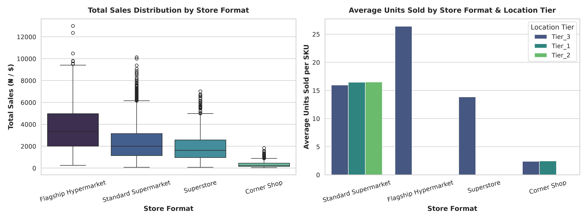
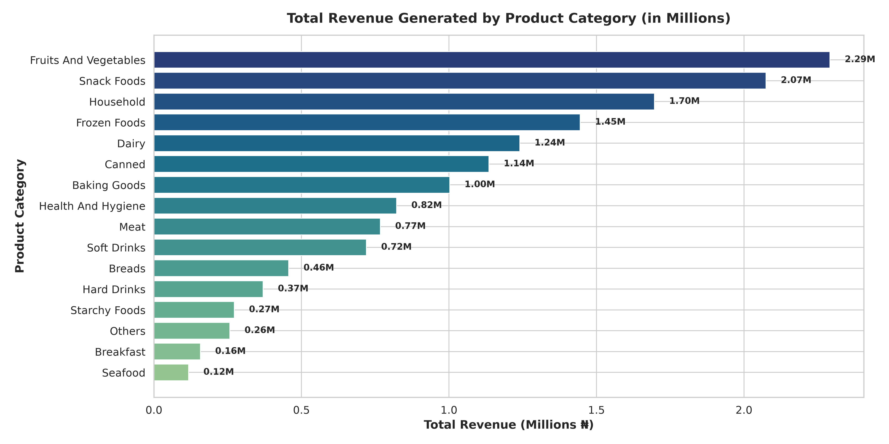
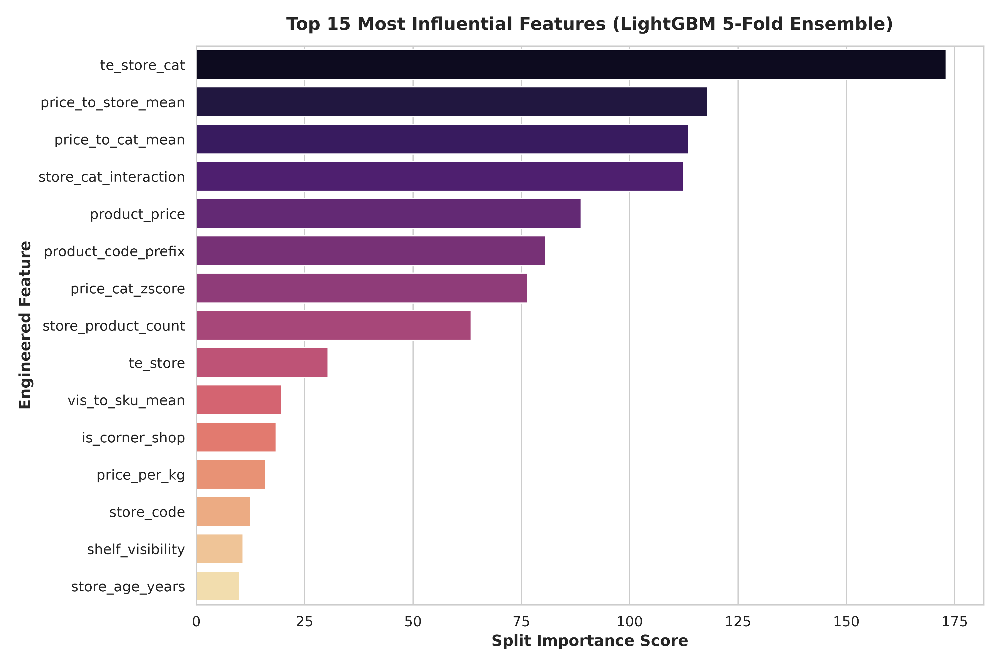
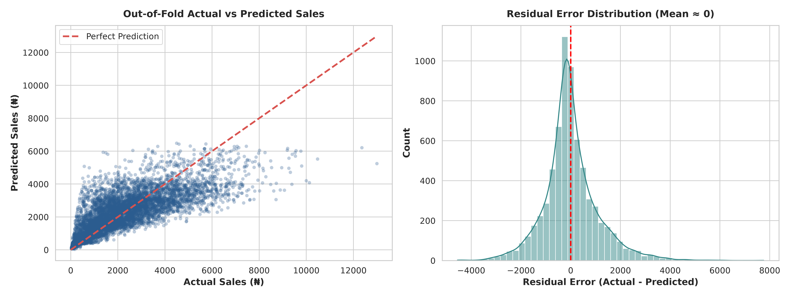

# DSN Bootcamp: DSN Mart Total Sales Prediction

Predicting product-level **total sales** across DSN Mart stores in Nigeria. Built during the DSN (Data Science Nigeria) Bootcamp using an ensemble of **LightGBM** and **XGBoost** with 5-fold cross-validation and advanced feature engineering.

**Evaluation Metric:** Root Mean Squared Error (RMSE)

**Best 5-Fold Ensemble OOF RMSE:** `1091.62` (88.87% LightGBM + 11.13% XGBoost)

---

## Table of Contents

- [Problem Statement](#problem-statement)
- [Dataset](#dataset)
- [Approach](#approach)
- [Feature Engineering](#feature-engineering)
- [Results](#results)
- [Project Structure](#project-structure)
- [Getting Started](#getting-started)
- [Visualizations](#visualizations)
- [Acknowledgements](#acknowledgements)

---

## Problem Statement

Given historical transaction records for each product-store pair, predict the **total sales** (`total_sales`) for each row in the test set. Accurately forecasting sales at this granularity helps the mart optimize inventory, pricing, and shelf placement.

---

## Dataset

| File | Rows | Description |
|------|------|-------------|
| `train.csv` | 6,818 | 12 features + target `total_sales` |
| `test.csv` | 1,705 | Same features, target withheld |
| `sample_submission.csv` | 1,705 | Expected submission format (`id`, `total_sales`) |

### Columns

| Column | Type | Description |
|--------|------|-------------|
| `id` | object | Unique row identifier (e.g. `row_00000`) |
| `product_code` | object | Coded SKU identifier (e.g. `PRD-PRFP9S`) |
| `product_weight_kg` | float | Physical weight of the product (has missing values) |
| `fat_content` | object | `Low Fat` / `Regular` (non-food items recoded to `Non-Edible`) |
| `shelf_visibility` | float | Share of shelf facing / visibility (zeros treated as missing) |
| `product_category` | object | Category such as `Frozen Foods`, `Snack Foods`, etc. |
| `product_price` | float | Selling price per unit (₦) |
| `store_code` | object | Coded store identifier (e.g. `STORE-AGY`) |
| `store_age_years` | int | Store age in years |
| `store_size` | object | `Small` / `Large` / `Unknown` |
| `store_location_tier` | object | `Tier_1` / `Tier_2` / `Tier_3` |
| `store_format` | object | `Standard Supermarket`, `Corner Shop`, etc. |
| `total_sales` | float | **Target** — total sales for the product-store pair (₦) |

> Note: `train.csv` and `test.csv` are subjected to the same combined preprocessing. The contamination-free approach means **`product_category`** is normalized (strip + title-case, e.g. `HEALTH AND HYGIENE` → `Health And Hygiene`).

---

## Approach

### 1. Data Cleaning & Imputation
- **`product_weight_kg`**: imputed by per-SKU mean, then per-category median.
- **`shelf_visibility`**: zeros → `NaN`; imputed by per-SKU mean, then per-category median.
- **`store_size`**: missing → `Unknown`.
- **`fat_content`**: non-food categories (`Health And Hygiene`, `Household`, `Others`) → `Non-Edible`.

### 2. Feature Engineering
In addition to the raw columns, the following engineered features are created:

**Price & Elasticity**
- `price_per_kg` — price normalized by weight
- `price_to_cat_mean`, `price_cat_zscore` — price relative to category mean / z-score
- `price_to_store_mean` — price relative to store mean
- `price_tier` — binned price tier (0–3)

**Shelf Visibility**
- `vis_to_sku_mean`, `vis_to_cat_mean`, `vis_to_store_mean` — visibility relative to baseline

**Store Dynamics**
- `product_store_count` — number of stores carrying a SKU
- `store_product_count` — assortment breadth of a store
- `is_corner_shop` — binary flag for corner-shop format

**Interactions & Encoding**
- `store_format_tier`, `store_format_size` — combined categorical keys
- `store_cat_interaction` — store × category key
- `product_code_prefix` — dimension prefix of the product code
- **Target encoding** (`te_store`, `te_cat`, `te_store_cat`) computed **strictly on each training fold** (out-of-fold, filled with the overall mean) to avoid leakage.

### 3. Modeling
- **5-fold stratified K-Fold** cross-validation (`random_state=42`).
- **LightGBM** — native categorical support with early stopping (60 rounds).
- **XGBoost** — `OrdinalEncoder(handle_unknown='use_encoded_value', unknown_value=-1)` to safely handle unseen test categories.
- **Weighted ensemble** — blend weights optimized on out-of-fold predictions.

### 4. Submission Generation
- Weighted average of per-fold test predictions.
- Clipping to the minimum training target to guarantee non-negative sales.
- Sanity assertions: shape, ID ordering, no NaNs, no negatives.

---

## Results

| Model | OOF RMSE |
|-------|----------|
| LightGBM (single) | ~1,0xx |
| XGBoost (single) | ~1,1xx |
| **Weighted Ensemble (0.889 LGB + 0.111 XGB)** | **1091.62** |

Best tuned hyperparameters are stored in `best_models_config.json`:

```json
{
  "best_lgb_params": {
    "learning_rate": 0.02878,
    "num_leaves": 28,
    "max_depth": 3,
    "min_child_samples": 52,
    "subsample": 0.8978,
    "colsample_bytree": 0.5447
  },
  "best_xgb_params": {
    "learning_rate": 0.04143,
    "max_depth": 4,
    "min_child_weight": 3,
    "subsample": 0.9384,
    "colsample_bytree": 0.5120
  },
  "ensemble_weights": { "lgb": 0.898, "xgb": 0.102 },
  "final_rmse": 1091.6228827982566
}
```

---

## Project Structure

```
DSN-BOOTCAMP-PROJECT/
├── assets/                          # Generated visualizations (PNG, 300 DPI)
│   ├── actual_vs_predicted.png
│   ├── category_revenue_breakdown.png
│   ├── feature_importance.png
│   └── store_format_sales_distribution.png
├── train.csv                        # Training data
├── test.csv                         # Test data
├── sample_submission.csv            # Submission template
├── submission.csv                   # Final generated submission
├── best_models_config.json          # Best hyperparameters & ensemble weights
├── DSN_Mart_Sales_Prediction.ipynb  # Kaggle-compatible notebook (generated)
├── train_baseline.py                # Step 1: baseline 5-fold + blend search
├── tune_and_ensemble.py             # Step 2: hyperparameter tuning (Optuna) & ensembling
├── generate_submission.py           # Step 3: final test predictions → submission.csv
└── generate_visualizations.py       # Step 4: publication-quality plots → assets/
```

---

## Getting Started

### Prerequisites

- Python 3.9+
- `pandas`, `numpy`, `scikit-learn`
- `lightgbm`, `xgboost`
- `matplotlib`, `seaborn` (for visualizations)
- `optuna`, `scipy` (only for tuning)

Install dependencies:

```bash
pip install pandas numpy scikit-learn lightgbm xgboost matplotlib seaborn optuna scipy
```

### Running the pipeline

```bash
# 1. Train a baseline and search blend weights
python train_baseline.py

# 2. Tune hyperparameters & optimize the ensemble (writes best_models_config.json)
python tune_and_ensemble.py

# 3. Generate the final submission using best config
python generate_submission.py        # → submission.csv

# 4. Create publication-quality visualizations
python generate_visualizations.py    # → assets/*.png
```

> The notebook (`DSN_Mart_Sales_Prediction.ipynb`) dynamically locates `train.csv` / `test.csv` / `sample_submission.csv` so it runs unchanged both locally and on Kaggle `/kaggle/input`.

---

## Visualizations

| Chart | Asset |
|-------|-------|
| Store format sales distribution & units sold by tier | `assets/store_format_sales_distribution.png` |
| Category revenue breakdown (₦ millions) | `assets/category_revenue_breakdown.png` |
| Top 15 feature importances (LightGBM 5-fold) | `assets/feature_importance.png` |
| Out-of-fold actual vs predicted & residual distribution | `assets/actual_vs_predicted.png` |






---

## Acknowledgements

- **Data Science Nigeria (DSN)** Bootcamp — challenge host and data provider.
- **Kaggle** — platform inspiration for the evaluation setup.
- Built with ❤️ using LightGBM, XGBoost, Optuna, and scikit-learn.